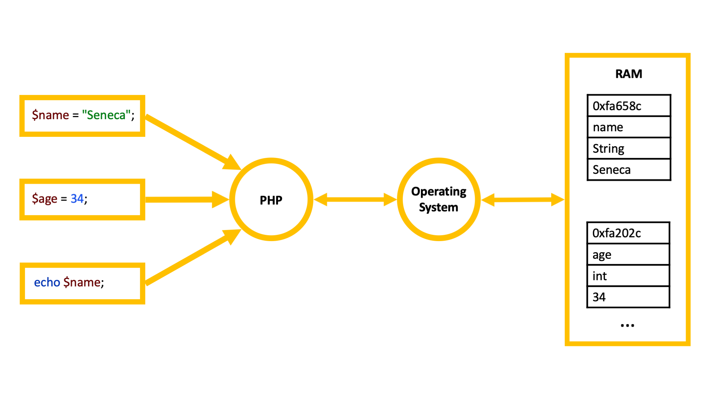
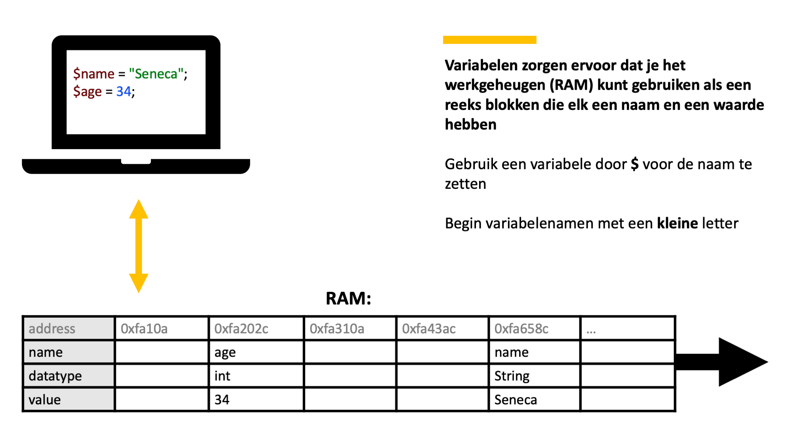
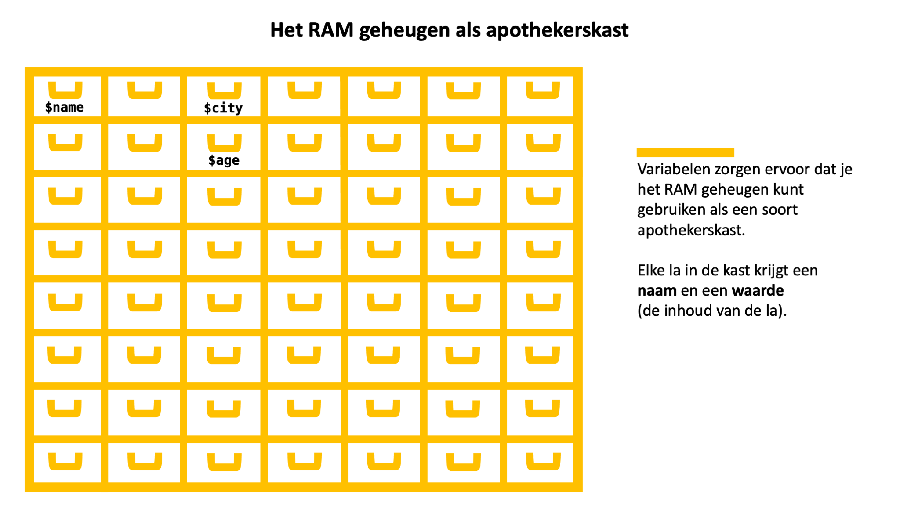

## Onderdeel van
Deze pagina is onderdeel van het **PHP basiskennis**
onderwijsmateriaal.

Voor een overzicht, ga naar **[PHP Basis: Overzicht](../php-basis)**.

## Slides

### Variabelen: schematisch


### Reeks blokken met naam en waarde


### Apothekerskast
Een simpeler analogie voor variabelen en het RAM geheugen is wellicht de apothekerskast. Het RAM geheugen bestaat uit heel veel lades. Elke lade heeft een etiket met de **naam** van wat erin zit en de **inhoud** van de la. Wat op het etiket staat is de naam van de variabele. De inhoud is de **waarde** van de variabele. 



### Downloads

[[pdf](php-basis-variabele.pdf)] [[pptx](php-basis-variabele.pptx) (bronbestand)]

## Beschrijving

Met variabelen kun je gegevens in het RAM geheugen opslaan en
opvragen. Variabelen zorgen ervoor dat je het RAM geheugen kunt
gebruiken als een soort apothekerskast. Elke la in de kast krijgt een
naam en een inhoud (die noemen we "waarde").

## Voorbeeld

```php
// opslaan (in RAM)
$city = 'Maastricht';
    
// op het scherm weergeven
echo $city;
    
// nieuwe waarde toekennen
$city = "Groningen";
```

## Externe documentatie
De officiële PHP documentatie mbt variabelen vind je op:

https://www.php.net/manual/en/language.variables.basics.php
